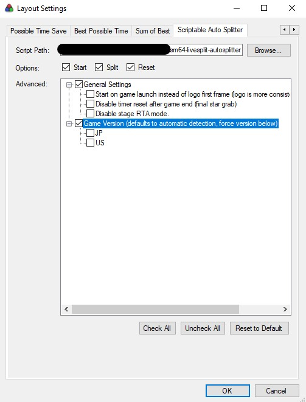
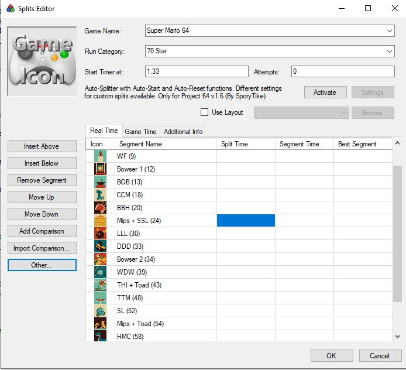
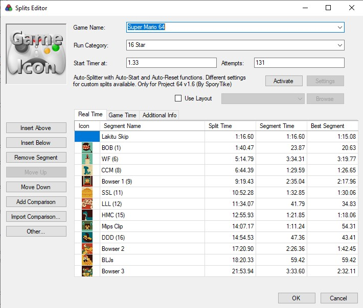
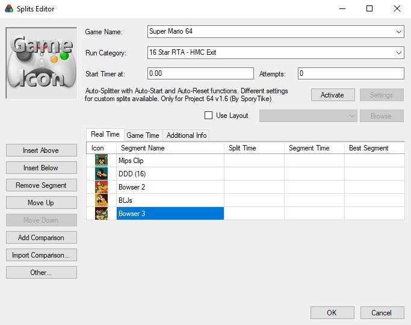
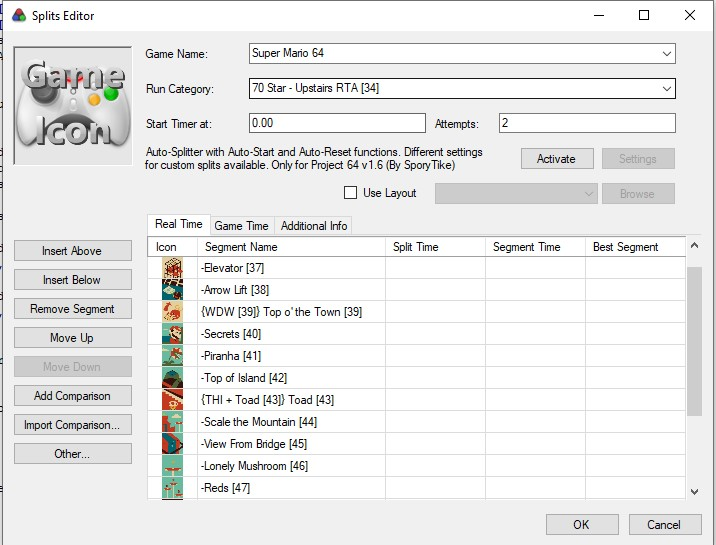
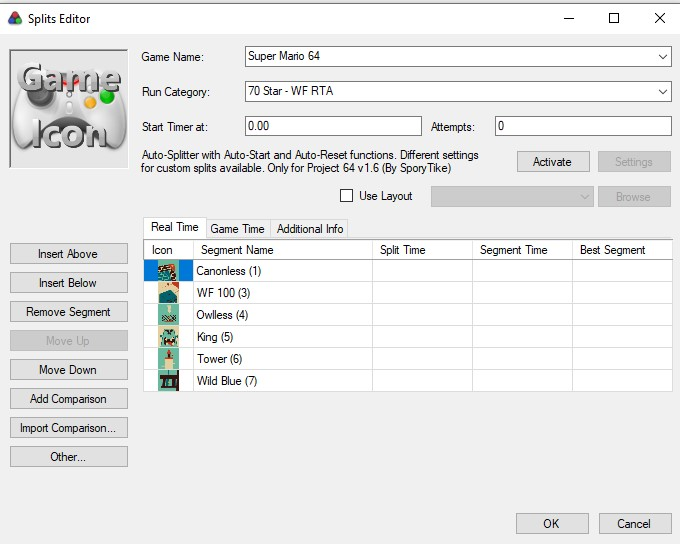

sm64-livesplit-autosplitter.asl - Super Mario 64 Livesplit Auto-Splitter
========================================================================

This is my personal autosplitter for livesplit to be used with Project64 1.6 for Super Mario 64.

It is heavily (**heavily**) inspired by a few other autosplitter, however these did not quite do it for me*, so I decided
to write my own. Still this would not exist without them, so please check them out:

- https://github.com/ColinT/banana-split
- https://github.com/andysandford/sm64-livesplit-autosplitter
- https://github.com/aglab2/LiveSplitAutoSplitters

You are welcome to try this splitter as well, it has worked well for me so far, however there might be bugs that slipped in.
If you report those, I will try to address them. I also welcome feature requests if you have any.

Here is a list of features of this auto splitter:
 
- **Zero Configuration**: all splitting defaults should be sane for the customs that SM64 community uses. Shouldn't need to configure anything.
- **Automatic ROM Version Detection**: the script detects which version is loaded in PJ64 memory automatically.
   - Supports both US and JP game versions.
   - Game ROM version can be switched at any time. No LiveSplit restart required.
   - Setting version in configuration is not required (and even discouraged).
- **Automatic Split Configuration**: the script uses the name of the splits for automatic detection. See Split Name Format, it
	follows the community convention for splitting the game.
- **RTA Mode**: automated RTA resetting/splitting to be used with usamune ROM.
- **Miscellaneous Features/Fixes**:
    - Resetting after game end resets timer correctly by default.

# Installation

- Download the ASL script on your computer.
- Open Livesplit, select your SM64 layout, right click -> Edit Layout.
- If not already present, click "+" button, "Control" and add "Scriptable Auto Splitter".
- Click "Layout Settings" and find "Scriptable Auto Splitter" tab.
- Under Script Path select the ASL script.
- You should now see settings in the box, all defaults should be fine (no change required).
- Save and Done.

# Split Name Format

There are 4 basic types of splits that can be defined:

- Star requirement split (stage, single star): when grabbing a certain number of stars. These split depending on a few conditions.
    - "HMC (15)"
- Bowser splits: split on bowser only after the key has been grabbed.
    - "Bowser 3"
    - "Key 1 (9)"
- Door split: split when touching either the basement door or the upstairs door.
    - "Upstairs \[74\]"
- Castle movement split: when measuring time between two stages
    - "Lakitu Skip"
    - "Mips"

In addition, two modifiers are available:

- Forbid auto-splitter to reset timer for current split. Add "\[reset\]" or "(reset)" anywhere in split name.
    - "Game is good \[noreset\]"
    - "Sound glitch (noreset)"
- Forbid the auto-splitter from splitting for current split. Add "\[manual\]" or "(manual)" anywhere in split name.
  You will have to split or skip manually. Can be used if auto-splitter is miss-behaving or if a condition is not
  supported.
    - "Thing or something \[manual\]"
    - "Not supported (manual)"

## Format Explained

### Star Requirement Split

This splits after a certain number of stars has been collected. To specify a number of stars, add "\[10\]" or "(10)" somewhere in the split name.

The splitting moment depends on a few conditions. Once the correct number of stars has been grabbed:

- If the star grab animation with stage exit is happening, the split will happen on fadeout.
- If the star grab animation does not exit stage (100 coins star), the split happens immediately. Exception: For bowser reds, split happens
  on pipe entry by default (settings can change this).
- If the star is grabbed in the castle, not a stage, the split happens when entering the next stage (fade in).

Note: If using subsplit, the first star requirement is used on the split with both subsplit category and split. 

### Bowser Split

To be considered a bowser split, the split name must contain "bowser" or "key" (in any case). This will only split when exiting the bowser
fight with the key. A star requirement may be added to these split. It does not change the split moment, however does prevent split if
the star was not collected before collecting the bowser key.

### Door Split

To be considered a door split, the split name must contain either "basement" or "upstairs" in its name. This will split only when the door
unlocking animation happens. Like bowser, a star requirement may be added and will prevent splitting if star have not all been collected.

### Castle Movement Split

This is any split that does not fit into the previous two categories. There cannot be two castle movement splits in a row, because the split
will happen when entering any stage in the castle. Splitting will happen on fade in to stage entry. Also to note, it is not possible to split
on stage entry for the stage that was just left. Castle movement must be between two different stages. This allows re-entering the previous
stage, using EXIT STAGE inside of pause menu to go back to castle lobby, then moving towards another stage.

### Examples

- "WF (9)" would split on stage exit at 9 stars.
- "THI + Toad (43)", toad is grabbed after the stage, split happens on TTM entry.

- "Mips Clip" is a castle movement split and splits on stage entry to DDD.
- "BLJs" splits movement from FS to Sky. Note that it is fine to re-enter FS to exit to lobby.
	This is the only stage that can be re-entered without splitting.

RTA Mode
--------

RTA mode is enabled when "RTA" is present in the category name for the splits. It adds reset and start conditions, with usamune ROM in mind.

Reset: If star count decreases, the timer is reset.

Additional start conditions:

- Star select screen is displayed (either through painting entry or usamune ROM menu)
- Stage is exited (fade-out)
- A key door is touched.
	
Splitting conditions (incl. last split) are identical.

## Examples (with Usamune ROM Interaction)

### Segment RTA (Stage EXIT)

This relies heavily on Usamune providing the right configuration for this segment. In this case, we are doing RTA from HMC exit
to end of the game.

To reset:

- Enter HMC stage.
- Under "MENU > DATA > For 16 Star" select "15". To reset your splits, flip between "9" and "15".
- Do a quick star in HMC to exit stage, timer will start on exit.

### Segment RTA (Door)

Like previously, Usamune ROM needs to provide configuration you need. In this case we will do 70 upstairs RTA from door touch.

To reset:

- Exit to lobby.
- Under "MENU > DATA > For 70 Star" select "34". To reset your splits, flip between "OFF" and "34".
- Touch the upstairs door, timer will star with door unlocking animation.

### Single Stage RTA

In the single stage RTA case, star count requirements should be starting from 0 stars. Usamune interaction looks like this:

Once in a while:

- Under "MENU > STAGE > STARTXT", select "1 Star", press A, increase CNT to 255 (each digit can be increased independently) and
  press A again. This removes the textboxes when certain number of stars are collected. Otherwise too hard to manage correctly.

To reset:

- If painting entry is desired, get in position. Otherwise usamune ROM stage select can be used.
- Under "MENU > DATA > For 0 Star", flip between OFF and DWEND. DWEND should be selected at the start of stage RTA. This resets all stars in stage.
- Enter painting or select stage in menu, this will start the timer.

**Footnotes:**

* Among the issues I ran into in various recommended autosplitters:
  - Too much configuration. Needs to be configured for each split file (category) differently.
  - Does not support castle movement splits.
  - Only supports one game version (only US, only JP).
  - Issues with split undo not being possible, eg. on final star last split.
  - Misses (reset, ...) due to refresh rate.
  - Generally liked some features of each one, but couldn't quite use any 100%.